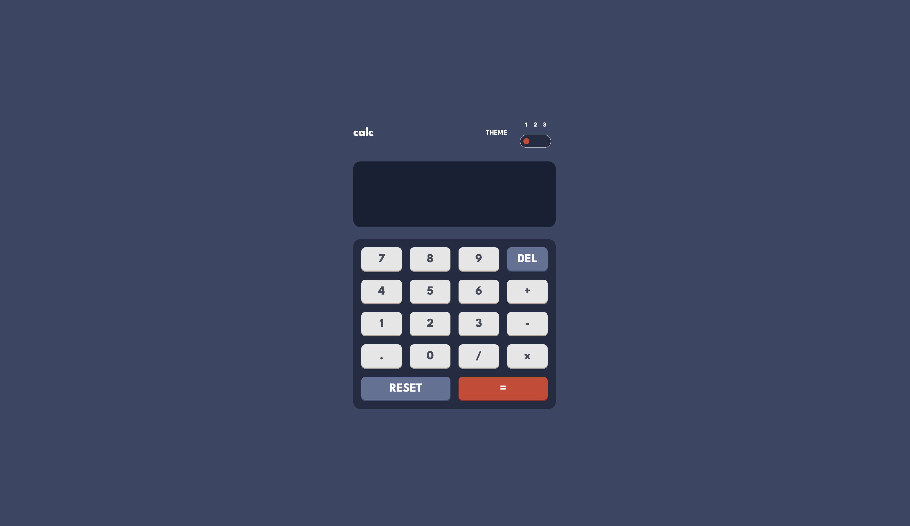

# Frontend Mentor - Calculator app solution

## Table of contents

- [Overview](#overview)
  - [The challenge](#the-challenge)
  - [Screenshot](#screenshot)
  - [Links](#links)
- [My process](#my-process)
  - [Built with](#built-with)
- [Author](#author)

## Overview

### The challenge

Users should be able to:

- See the size of the elements adjust based on their device's screen size
- Perform mathmatical operations like addition, subtraction, multiplication, and division
- Adjust the color theme based on their preference

### Screenshot

### Links

- Solution URL: [Solution URL here](https://github.com/ifeoluwah21/Simple-Calculator)
- Live Site URL: [Live site URL here](https://simple-calculator-bice-chi.vercel.app/)

## My process

### Built with

- [React](https://reactjs.org/) - JS library
- Typescript
- TailwindCSS
- ShadCN

## Author

- Frontend Mentor - [@ifeoluwah21](https://www.frontendmentor.io/profile/ifeoluwah21)
- Twitter - [@\_ifeoluwaaa](https://www.twitter.com/_ifeoluwaaa)
